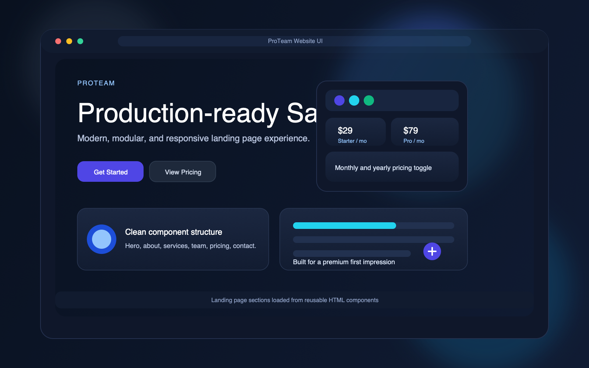

# ProTeam Website UI

An elegant, production-ready SaaS landing page designed to feel fast, modern, and polished from the first scroll.

Built with plain HTML, Tailwind CSS, and lightweight JavaScript, this project keeps the experience simple to run while still delivering a premium, component-based interface.

[](#getting-started)
[](#tech-stack)
[](#tech-stack)
[](#license)

## Highlights

- Responsive landing page layout
- Modular sections for hero, about, services, team, pricing, contact, and footer
- Smooth scrolling navigation
- Scroll-triggered reveal animations
- Auto-advancing team member slider
- Monthly and yearly pricing toggle
- Clean, reusable component structure
- No build step required

## Tech Stack

- HTML5
- Tailwind CSS via CDN
- Font Awesome icons
- Vanilla JavaScript

## Screenshot



## Project Structure

```text
ProTeam_website_UI/
├── index.html
├── assets/
│   ├── css/
│   │   └── style.css
│   └── js/
│       ├── main.js
│       └── pricing.js
└── components/
    ├── navbar.html
    ├── hero.html
    ├── about.html
    ├── services.html
    ├── team.html
    ├── pricing.html
    ├── contact.html
    └── footer.html
```

## How It Works

`index.html` acts as the shell for the app. On page load, it fetches each HTML component from the `components/` folder and injects it into the matching placeholder element.

Once the sections are loaded, `assets/js/main.js` initializes the UI behavior:

- navbar scroll state
- reveal animations
- smooth anchor scrolling
- team slider autoplay

The pricing section uses `assets/js/pricing.js` to switch between monthly and yearly plans with a simple animated toggle.

## Getting Started

Because the page loads HTML components with `fetch`, it should be opened from a local web server rather than directly with `file://`.

### Option 1: VS Code Live Server

1. Open the project in VS Code
2. Install the Live Server extension if needed
3. Right-click `index.html`
4. Choose `Open with Live Server`

### Option 2: Python HTTP Server

```bash
python3 -m http.server 8000
```

Then open:

```text
http://localhost:8000
```

## Customization

- Update the content in `components/` to change each section
- Edit `assets/css/style.css` for site-specific styling
- Modify `assets/js/main.js` for navigation, animations, or slider behavior
- Adjust `assets/js/pricing.js` to change pricing values or toggle behavior

## Notes

- The loader in `index.html` helps prevent layout flashing before the components finish loading.
- The site is designed to be easy to extend with additional sections or interactions.

## License

This project is licensed under the MIT License. See the [LICENSE](LICENSE) file for details.
